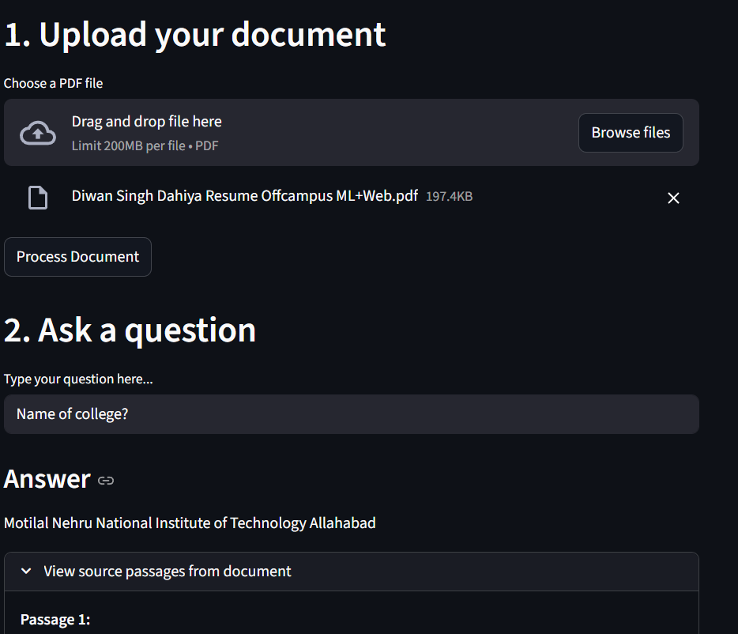

# 📄 DocQA — Document Question Answering using Endee

> Upload any PDF and ask questions about it in natural language.  
> Powered by **Endee vector database**, **sentence-transformers**, and **Llama3 via Groq**.

---

## 🧩 Problem Statement

Reading long documents to find specific information is time-consuming.  
This project lets users **upload any PDF** and instantly **ask questions** about it in natural language, getting **accurate answers grounded in the document**.

---

## 🖼️ Demo Screenshot



---

## ⚙️ System Design
```
User → Streamlit UI → PDF Processor → Embedder → Endee Vector DB
                    ↘ Question Encoder → Endee Search → LLM → Answer
```

1. PDF is extracted and split into **500-character overlapping chunks**
2. Each chunk is converted to a **vector** using sentence-transformers
3. Vectors and original text are **stored in Endee vector DB**
4. User question is also **embedded** into a vector
5. Endee finds the **5 most semantically similar chunks**
6. **Llama3 via Groq** generates a grounded answer from those chunks

---

## 🗄️ How Endee Is Used

Endee serves as the **vector database backbone** of this project.

- An index with **384 dimensions** and **cosine similarity** is created in Endee
- Document chunk embeddings are stored via **`index.upsert()`**
- At query time, **`index.query()`** retrieves the top-k most similar chunks
- Endee enables **fast and accurate semantic search** over document content

---

## 🛠️ Tech Stack

| Component | Technology |
|---|---|
| **Vector Database** | Endee (via Docker) |
| **Embeddings** | paraphrase-MiniLM-L3-v2 (sentence-transformers) |
| **LLM** | Llama3-70b via Groq API (free) |
| **UI** | Streamlit |
| **PDF Parsing** | PyPDF2 |

---

## 🚀 Setup and Run

### Prerequisites
- Python 3.10+
- Docker Desktop

### Steps

**1. Clone this repository**
```bash
git clone https://github.com/diwandahiya304/Endee-Project
cd Endee-Project
```

**2. Start Endee vector database**
```bash
docker compose up -d
```

**3. Install dependencies**
```bash
pip install -r requirements.txt
```

**4. Add your Groq API key**

Create a `.env` file in the project folder:
```
GROQ_API_KEY=your_key_here
```

**5. Run the app**
```bash
python -m streamlit run app.py
```

**6. Open your browser at** `http://localhost:8501`

---

## 📁 Project Structure
```
Endee-Project/
├── app.py              # Streamlit UI
├── pdf_utils.py        # PDF extraction and chunking
├── embedder.py         # Text to vector embeddings
├── db_utils.py         # Endee vector DB operations
├── qa_engine.py        # LLM answer generation
├── docker-compose.yml  # Endee database setup
├── requirements.txt    # Python dependencies
└── README.md           # Project documentation
```

---

## 💡 How It Works

1. 📤 **Upload** any PDF document
2. ⚙️ **Click** Process Document — extracts, chunks, embeds and stores in Endee
3. ❓ **Ask** any question about the document
4. ✅ **Get** accurate AI-powered answers with source passages shown